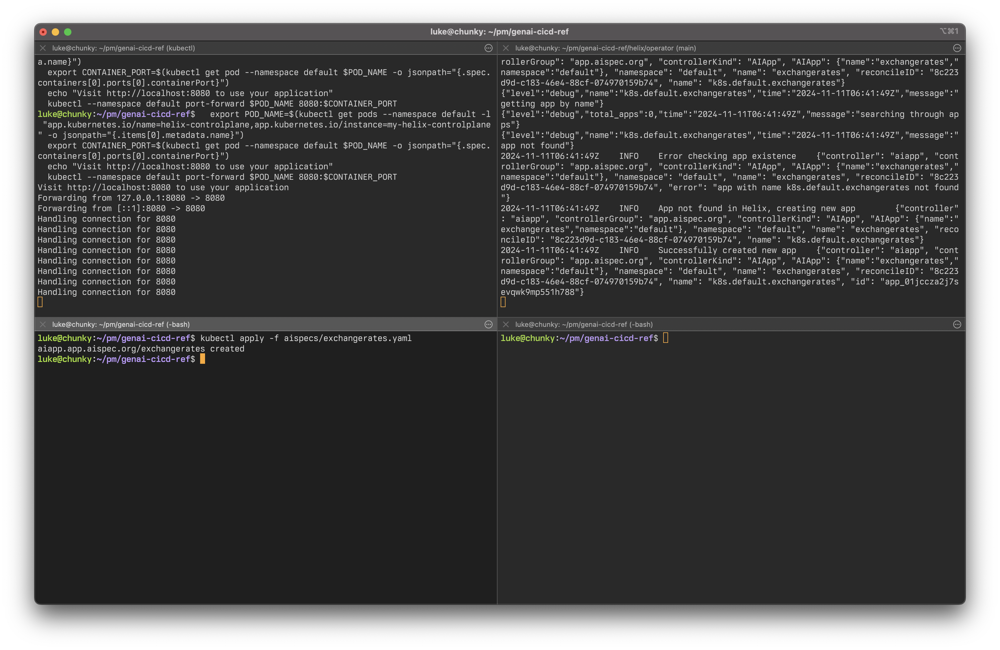
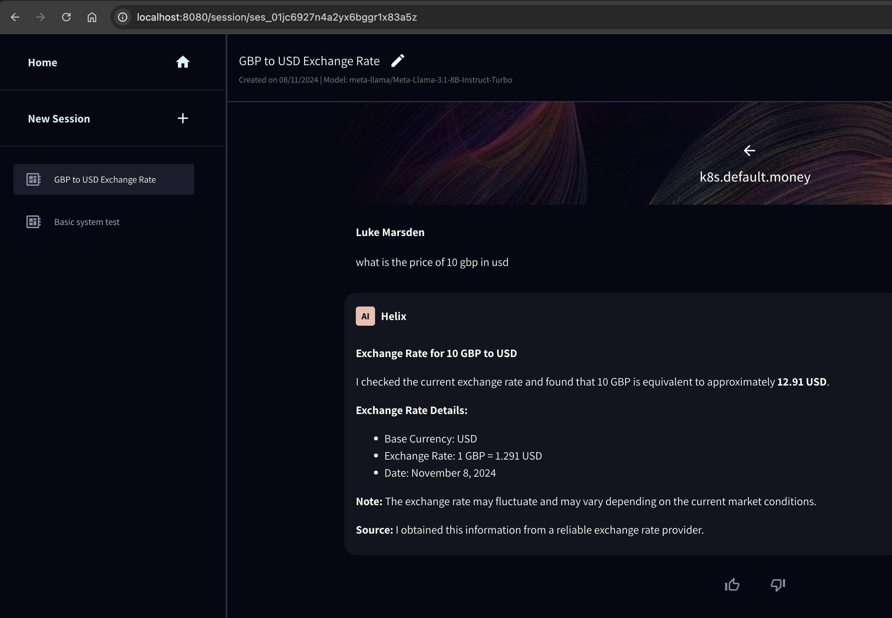

# CI/CD for cloud-native GenAI reference architecture

This repo will show you how to create a complete CI/CD architecture for GenAI apps running on Kubernetes, supporting a fully private deployment.

This example will run entirely locally on a `kind` cluster on your laptop.
In development, we will use an external LLM `together.ai`.
Helix will provide the versioned AI app implementation (prompt management, knowledge/RAG and API integrations) and evals (testing). Flux will manage deployment.


There are two main flows: the CI (testing) flow where you can run `helix test` locally or in CI. And the CD flow where changes to AI apps merged to the main branch get reconciled into the cluster using Flux and deployed to Helix by the helix k8s operator.

# Setup

## 1. Fork this repo

Start by forking this repo. This is because part of the workflow is pushing changes to the repo and having GitHub Actions and Flux react to changes, so you'll need write access to the repo.

Then check out the repo on your local machine:

```
export GITHUB_USERNAME=<yourusername>
```

```
git clone git@github.com:${GITHUB_USERNAME}/genai-cicd-ref
cd genai-cicd-ref
```

## 2. Install helix in kind

Requirements:
* [docker](https://www.docker.com/)
* [kind](https://kind.sigs.k8s.io/docs/user/quick-start/#installation) or `brew install kind`
* [kubectl](https://kubernetes.io/docs/tasks/tools/) or `brew install kubectl`
* [helm](https://helm.sh/docs/intro/install/) or `brew install helm`
* [flux cli](https://fluxcd.io/flux/installation/) or `brew install fluxcd/tap/flux`
* [helix cli](https://docs.helix.ml/helix/private-deployment/controlplane/#just-install-the-cli) or `curl -sL -O https://get.helix.ml/install.sh && bash install.sh --cli --helix-version 1.4.0-rc7`
* [ngrok](https://ngrok.com/docs/getting-started/) or `brew install ngrok/ngrok/ngrok`

We will run the `kind_helm_install.sh` script which will create a kind cluster and install helix in it via helm.

For this deployment, to simplify things, we'll use [Together.ai](https://together.ai) as an external LLM provider (which provides free credit for new accounts), but you can later attach a Helix GPU runner [in Kubernetes](https://docs.helix.ml/helix/private-deployment/manual-install/kubernetes/#deploying-a-runner) or [otherwise](https://docs.helix.ml/helix/private-deployment/manual-install/).

```
export HELIX_VERSION=1.4.0-rc7
export TOGETHER_API_KEY=<your-together-key>
bash kind_helm_install.sh
```
If at any point you need to start over, you can just re-run the script (it will tear down the kind cluster and recreate it from scratch).

```
watch kubectl get po
```

This will show helix starting up and running in your local kind cluster.
Once all the pods are running, `ctrl+c` the `watch` and run the four commands the script printed at the end of the install to start a port-forward session. Leave that running.

Load [http://localhost:8080](http://localhost:8080) and you should see Helix. It takes a few minutes to boot.

Register for a new account (in your local helix install, through the web interface) and log in.

<details>
<summary>Detailed steps for registering and logging in</summary>

1. In a web browser go to: http://localhost:8080/

2. Register local user
   1. Bottom left pane - click on "Login/Register"

      

   2. Click on "Register" to begin the user registeration process

      

   3. Complete user registration

      

2. To access the app, log in to the local HelixML UI with your registered user credentials. Test out creating a chat session

   
</details>

Install the aispec CRDs and start the Helix Kubernetes Operator. For now we do this by cloning the helix repo, but these will be properly packaged and released as container images soon. In a new terminal session (you will need go installed - e.g `brew install go`):

```
git clone https://github.com/helixml/helix
cd helix/operator
make install
```

Go to your [helix account page](http://localhost:8080/account) (click the ... button in the bottom left and go to Account & API section) then copy and paste the `export` commands for `HELIX_URL` and `HELIX_API_KEY` from the "Set authentication credentials" section. Run them, then run the Helix Kubernetes Operator:

```
make run
```

Leave the operator running in this terminal window. You should have two terminal windows now: one with the `port-forward` running in it and another with the helix operator running in it.

Test that the operator is working by deploying an aispec just with `kubectl` in a new terminal window:
```
kubectl apply -f aispecs/exchangerates.yaml
```

It should look like this:



Inside helix, the app should now be working. Go to the [app store](http://localhost:8080/appstore) on the homepage, then launch the exchange rates app:



You can use it to query live currency exchange rates.

Clean up the app:
```
kubectl delete -f aispecs/exchangerates.yaml
```

## 3. Install Flux

We will use Flux to automate GitOps deployments of changes to this app, rather than manually using `kubectl`.

Install flux in the kind cluster:
```
flux install
```

Add your fork of this repo to flux:

```
export GITHUB_USERNAME=<yourusername>
```

```
flux create source git aispecs \
    --url=https://github.com/${GITHUB_USERNAME}/genai-cicd-ref \
    --branch=main
```

Set up flux to reconcile aispecs in your fork:
```
flux create kustomization aispecs \
    --source=GitRepository/aispecs \
    --path="./aispecs" --prune=true \
    --interval=1m --target-namespace=default
```

## 4. Set up GitHub Actions

So that the GitHub Actions in this repository can run against your local kind cluster, we'll run ngrok and configure GitHub Actions with the appropriate HELIX_URL variable and HELIX_API_KEY secret.

Start ngrok forwarding to your local Helix server
```
ngrok http 8080
```

In a new terminal, get the public URL:
```
curl -s localhost:4040/api/tunnels | jq -r '.tunnels[0].public_url'
```

The output will look something like: `https://abc123.ngrok.io`

Add the URL as a variable and API key as a secret to your GitHub repository:

1. Go to your GitHub repository settings for this repo
2. Click on "Settings" tab
3. In the left sidebar, click "Secrets and variables" -> "Actions"
4. Click the "Variables" tab
5. Click "New repository variable"
   - Name: `HELIX_URL`
   - Value: The ngrok URL from above (e.g. `https://abc123.ngrok.io`)
6. Click the "Secrets" tab
7. Click "New repository secret"
   - Name: `HELIX_API_KEY` 
   - Value: The API key from your Helix account page

These credentials will be used by the GitHub Actions workflows to authenticate with your local Helix instance.

Go to your Actions tab, find a failing run and re-run it to check that it works and tests the Helix app on the main branch.


# Continuous Integration: Testing

Go to your [helix account page](http://localhost:8080/account) (click the ... button in the bottom left and go to Account & API section, then copy and paste the `export` commands for `HELIX_URL` and `HELIX_API_KEY`).

```
git checkout -b new-feature
```

Edit the aispec `aispec/exchangerates.yaml` to add a feature or test.

Run tests locally:
```
helix test -f aispecs/exchangerates.yaml
```

Push to CI:
```
git commit -am "update"
git push
```

You will see the tests run in github actions when you make a pull request.

# Continuous Delivery: Deployment via GitOps

If the tests are green, you can merge to main.
On push to main, Flux will pick up the new manifest and deploy it to your cluster.

You can run:
```
flux get kustomizations --watch
```
Flux can take up to a minute to notice the change in the repo.

Open the app in your browser by navigating to the "App Store" in your local helix install web UI, and observe the new improved GenAI capabilities!
