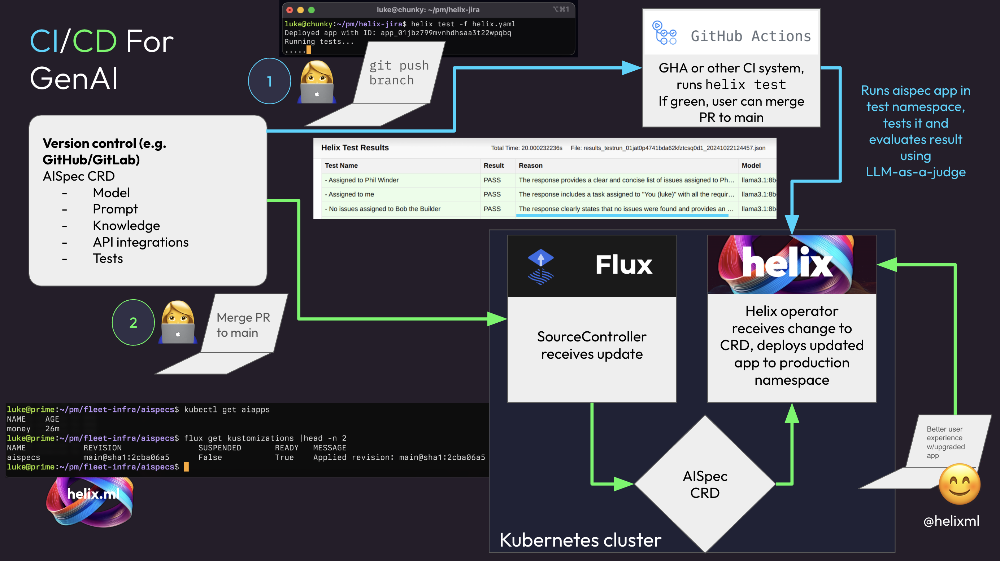

# CI/CD for cloud-native GenAI reference architecture

This repo will show you how to create a complete CI/CD architecture for GenAI apps.

This example will run entirely locally on a `kind` cluster on your laptop.
In development, you can use an external LLM, such as `together.ai`.



There are two main flows: the CI (testing) flow where you can run `helix test` locally or in CI.

# Setup

## 1. Fork this repo

Start by forking this repo. This is because part of the workflow is pushing changes to the repo and having GitHub Actions and Flux react to changes, so you'll need write access to the repo.

Then check out the repo on your local machine:

```
git clone git@github.com:<yourusername>/genai-cicd-ref
cd genai-cicd-ref
```

## 2. Install helix in kind

Requirements:
* [kind](https://kind.sigs.k8s.io/docs/user/quick-start/#installation)
* [docker](https://www.docker.com/)
* [kubectl](https://kubernetes.io/docs/tasks/tools/)
* [helm](https://helm.sh/docs/intro/install/)
* [flux cli](https://fluxcd.io/flux/installation/)

We will run the `kind_helm_install.sh` script which will install helix in kind via helm.

For this deployment, to simplify things, we'll use [Together.ai](https://together.ai) as an external LLM provider, but you can later attach a Helix GPU runner [in Kubernetes](https://docs.helix.ml/helix/private-deployment/manual-install/kubernetes/#deploying-a-runner) or [otherwise](https://docs.helix.ml/helix/private-deployment/manual-install/).

```
export HELIX_VERSION=1.4.0-rc3
export TOGETHER_API_KEY=<your-together-key>
bash kind_helm_install.sh
```

Run the commands it prints at the end to start a port-forward session. Leave that running and open a new terminal window.

```
kubectl get po
```

Should show helix starting up and running in your local kind cluster.
Load [http://localhost:8080](http://localhost:8080) and you should see Helix. It takes a few minutes to boot.

Register for a new account (in your local helix install, through the web interface) and log in.

Install the aispec CRDs and start the Helix Kubernetes Operator. For now we do this by cloning the helix repo, but these will be properly packaged and released as container images soon.

```
git clone https://github.com/helixml/helix
cd helix/operator
make install
make run
```

Leave the operator running in another terminal window. You should have two terminal windows now: one with the `port-forward` running in it and another with the helix operator running in it.

## 3. Install Flux

Install flux in the kind cluster:
```
flux install
```

Add your fork of this repo to flux:

```
flux create source git aispecs \
    --url=https://github.com/<yourusername>/genai-cicd-ref \
    --branch=main
```

Set up flux to reconcile aispecs in your fork:
```
flux create kustomization aispecs \
    --source=GitRepository/aispecs \
    --path="./aispecs" --prune=true \
    --interval=1m --target-namespace=default
```

[TODO: set up ngrok and set up env vars in GHA so that CI runs against local cluster.]

# Continuous Integration: Testing

Go to your helix account page (click the ... button in the bottom left and go to Account & API section, then copy and paste the `export` commands for `HELIX_URL` and `HELIX_API_KEY`).

```
git checkout -b new-feature
```

Edit the aispec `aispec/money.yaml` to add a feature or test.

Run tests locally:
```
helix test -f aispecs/money.yaml
```

Push to CI:
```
git commit -am "update"
git push
```

(CI won't work unless you configure ngrok which is outside of the scope of this tutorial for now.)

# Continuous Delivery: Deployment via GitOps

If the tests are green, you can merge to main.
On push to main, Flux will pick up the new manifest and deploy it to your cluster.

You can run:
```
flux get kustomizations --watch
```
Flux can take up to a minute to notice the change in the repo.

Open the app in your browser, and observe the new improved GenAI capabilities!